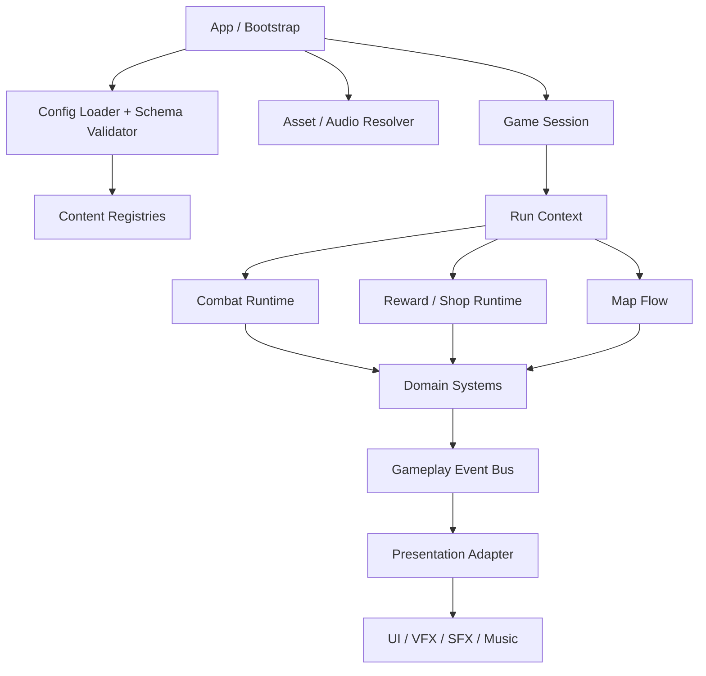
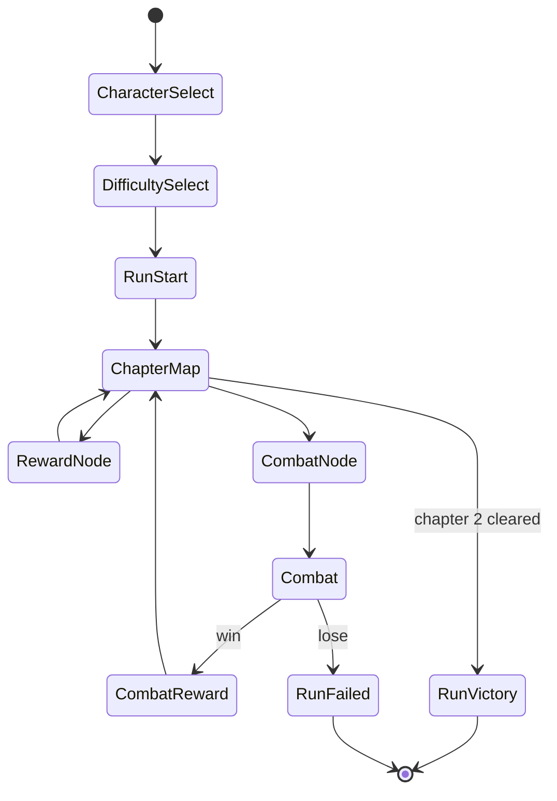
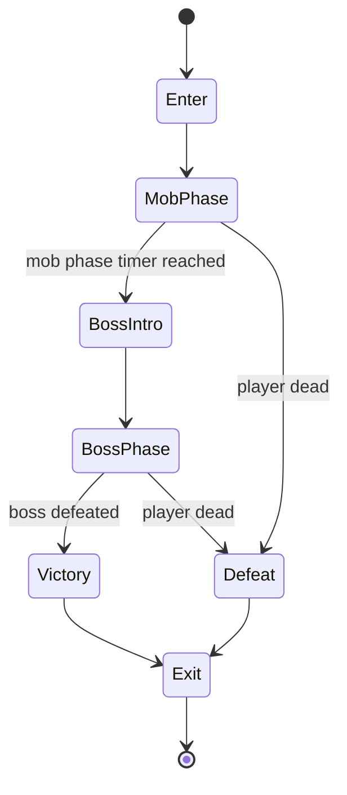

# Puritato 游戏实现架构

## 目标与边界

本文档基于 `docs/gameplay-design` 中的玩法设计，定义 Puritato 的实现架构。架构目标是支撑 Demo 闭环，并为后续章节、学派、Boss、模式和平台迭代保留水平扩展能力。

核心要求：

- 游戏逻辑固定 60 帧运行，所有玩法计时、冷却、攻击间隔、buff 结算、刷怪节奏都以逻辑帧或可换算的秒数配置。
- 所有数值可配置化，包括角色属性、武器、魔法、道具、怪物、Boss、地图节点、奖励、商店、价格、buff、掉落、音乐、特效、资源引用和难度倍率。
- 美术资源、音乐资源可替换、可切换，不与玩法逻辑硬绑定。
- 武器、魔法、地图、战斗、buff、音乐、配置、物品池、经济、背包、强化、融合、奇遇、奖励等系统都以数据驱动方式接入。
- 支持新增学派、新武器、新魔法、新道具、新节点、新怪物、新 Boss、新章节、新模式时尽量只新增配置和少量独立行为脚本。

## 总体原则

### 固定逻辑帧

运行时采用固定步长主循环：

- 逻辑帧率：60 FPS。
- 单帧时长：`1 / 60` 秒。
- 玩法系统只读取 `tick_index`、`frame_delta = 1` 或固定秒数换算，不直接依赖渲染帧 `delta`。
- 渲染、动画、粒子、音频淡入淡出可以使用真实时间或插值，但不得反向影响战斗结果。
- 配置中允许使用秒作为设计输入，但加载后统一转换为帧，例如 `10s -> 600 frames`。

推荐主循环：

```text
while accumulated_time >= fixed_step:
  tick_index += 1
  read_buffered_input()
  update_gameplay_systems_one_tick()
  emit_presentation_events()
  accumulated_time -= fixed_step

render(interpolation_alpha)
```

### 数据驱动

所有内容都应由配置声明，再由运行时系统解释：

- 配置描述“是什么”：武器属性、魔法效果、buff 标签、商店价格、刷怪表、地图路线。
- 系统实现“怎么运行”：目标选择、伤害结算、buff 栈处理、奖励抽取、资源播放。
- 特殊规则通过可组合的 `effect`、`condition`、`modifier`、`trigger` 声明，确实无法声明时才接入独立脚本。

### 逻辑与表现分离

玩法逻辑只引用资源占位 ID，不直接引用具体图片、音频或特效文件。表现层通过资源主题包解析占位 ID：

```text
weapon.fries.icon -> art pack resolves to res://...
weapon.fries.attack_sfx -> audio pack resolves to res://...
combat.chapter_1.bgm -> music set resolves to res://...
```

这样同一个玩法配置可以切换美术皮肤、音效包、语言包和音乐包。

战斗角色表现也遵守该边界：角色本体、武器握持点、武器 sprite、武器特效是独立表现资源。土豆角色在战斗内可以没有真实手臂，武器栏由围绕角色的圆形悬浮手/握持点表现；武器攻击只驱动握持点、武器和特效动画，不要求角色本体拥有攻击动作。角色概念图、头像和剧情插画可以保留有手造型，但不作为战斗 runtime 的骨骼或动作约束。

### 可扩展注册表

所有内容进入统一注册表：

- `CharacterRegistry`
- `SchoolRegistry`
- `WeaponRegistry`
- `MagicRegistry`
- `ItemRegistry`
- `BuffRegistry`
- `MonsterRegistry`
- `BossRegistry`
- `MapNodeRegistry`
- `RewardTableRegistry`
- `EncounterRegistry`
- `AudioRegistry`
- `AssetRegistry`

系统之间通过 ID、标签和事件通信，避免互相硬编码类名。

## 运行时分层



### App / Bootstrap

职责：

- 初始化引擎、平台适配、输入、存档、配置加载、资源主题包。
- 加载基础配置、DLC/扩展配置、语言包、资源包。
- 校验配置 schema 和引用完整性。
- 进入主菜单、角色选择和难度选择流程。

### Game Session

表示一次应用内游戏会话，持有：

- 当前用户设置。
- 当前资源主题包。
- 全局随机种子策略。
- 存档访问器。
- 调试开关和遥测接口。

### Run Context

表示一局 roguelike 流程，持有：

- 角色、难度、模式、随机种子。
- 当前章节、当前小关、累计层数。
- 金币、背包、装备、已获得物品计数。
- 当前构筑覆盖的学派集合。
- 地图路径选择历史。
- 战斗结果与奖励历史。

`RunContext` 是地图、奖励、商店、战斗之间共享的权威状态。

### Combat Runtime

表示一场战斗，进入战斗时从 `RunContext` 创建快照：

- 锁定当前装备栏。
- 初始化玩家、怪物、Boss、投射物、区域、召唤物、光环。
- 按 60 FPS 固定 tick 推进。
- 结束后只把结算结果写回 `RunContext`，例如胜负、金币、奖励、消耗、统计。

## 推荐目录结构

```text
docs/
  gameplay-design/
  architecture/
src/
  core/
    fixed_tick_loop.*
    event_bus.*
    registry.*
    rng.*
    ids.*
  app/
    bootstrap.*
    game_session.*
    save_service.*
    settings_service.*
  config/
    config_loader.*
    schema_validator.*
    content_pack_loader.*
  domain/
    run/
    map/
    reward/
    economy/
    inventory/
    school/
    combat/
    weapon/
    magic/
    item/
    buff/
    monster/
    boss/
  presentation/
    ui/
    vfx/
    audio/
    animation/
    localization/
content/
  base/
    characters/
    schools/
    weapons/
    magics/
    items/
    buffs/
    monsters/
    bosses/
    maps/
    rewards/
    shops/
    encounters/
    difficulties/
    audio/
    assets/
  packs/
assets/
  art/
  audio/
  vfx/
tests/
  config/
  domain/
  simulation/
```

具体文件扩展名由引擎决定。若使用 Godot，可将权威配置保留为 JSON/YAML/TOML 便于版本管理，再在导入阶段转换为 `.tres`、`.res` 或运行时缓存。

## 配置系统

### 配置加载流程

```text
load base configs
load enabled content packs
merge by id and priority
validate schema
validate references
normalize units
build registries
report warnings/errors
```

加载规则：

- 每个配置条目必须有稳定 `id`。
- 配置支持 `version`，用于迁移和兼容旧存档。
- 扩展包可以新增条目，也可以按规则覆盖基础条目。
- 所有数值单位必须明确：帧、秒、像素、倍率、百分比、金币、权重。
- 秒数在加载后转换为帧数，避免战斗中反复换算。

### 通用配置字段

多数内容条目共享以下字段：

```yaml
id: weapon.metamorph.fries
display_name_key: weapon.fries.name
description_key: weapon.fries.desc
tags: [weapon, melee, metamorph]
school_ids: [school.metamorph]
primary_school_id: school.metamorph
rarity: common
acquire_limit: 0
enabled: true
asset_refs:
  icon: weapon.fries.icon
  model_or_sprite: weapon.fries.sprite
audio_refs:
  use_sfx: weapon.fries.attack
  hit_sfx: weapon.fries.hit
```

### Schema 校验

必须在启动或内容热重载时校验：

- ID 唯一性。
- 引用存在性。
- 数值范围，例如概率 `0..1`、权重 `>= 0`、价格 `>= 0`。
- 循环引用，例如 buff 触发 buff 时不能形成无终止递归。
- 学派限制、获取数量上限、装备栏类型、资源占位是否存在。

## 状态机

### 单局流程状态机



### 战斗状态机



## 事件与效果系统

### Gameplay Event Bus

战斗、奖励、商店和地图节点都通过事件驱动副作用：

```text
OnRunStarted
OnNodeEntered
OnRewardOffered
OnItemPurchased
OnCombatStarted
OnTick
OnWeaponFired
OnMagicCast
OnHit
OnDamageCalculated
OnDamageApplied
OnBuffApplied
OnBuffTick
OnEnemyKilled
OnBossSpawned
OnCombatWon
OnCombatLost
```

事件分为两类：

- 逻辑事件：参与结算，必须固定顺序、可回放。
- 表现事件：用于 UI、音效、特效、镜头，不影响结算。

### 同帧结算顺序

默认优先级沿用玩法文档：

1. 角色被动。
2. 道具被动。
3. 武器技能。
4. 魔法自动释放。
5. Buff 触发。

同类效果按装备栏顺序、获得顺序或配置的 `priority` 结算。所有会影响结果的顺序都必须可配置或可推导，不能依赖容器遍历的不稳定顺序。

### Effect DSL

武器、魔法、道具、buff、奇遇和奖励都应复用同一套效果描述：

```yaml
effects:
  - trigger: on_hit
    conditions:
      - type: target_has_tag
        tag: enemy
    actions:
      - type: apply_buff
        buff_id: buff.bruise
        target: hit_target
        stacks: 1
```

基础 action 类型：

- `modify_stat`
- `deal_damage`
- `heal`
- `restore_mana`
- `gain_energy`
- `apply_buff`
- `remove_buff`
- `spawn_projectile`
- `spawn_area`
- `spawn_summon`
- `add_currency`
- `grant_item`
- `offer_reward`
- `change_pool_weight`
- `unlock_slot`
- `discount_shop`
- `transform_item`

## 核心数据模型

### Entity

战斗内对象使用轻量实体模型：

- `Player`
- `Monster`
- `Boss`
- `Projectile`
- `AreaEffect`
- `Summon`
- `Pickup`

实体由组件组成：

- `TransformComponent`
- `VelocityComponent`
- `StatsComponent`
- `HealthComponent`
- `ManaComponent`
- `EnergyComponent`
- `CollisionComponent`
- `BuffContainerComponent`
- `WeaponControllerComponent`
- `MagicControllerComponent`
- `AIComponent`
- `LifetimeComponent`
- `PresentationRefComponent`

### Stats

属性系统分为基础值、加法修正、乘法修正和最终修正：

```text
final = ((base + flat_add) * (1 + additive_percent)) * multiplicative_modifiers + final_add
```

Demo 至少支持：

- 最大生命、当前生命、生命恢复。
- 最大法力、当前法力、法力恢复。
- 能量上限、当前能量。
- 近战攻击、远程攻击、魔法强度。
- 攻击范围、速度、防御、减伤率。
- 攻击速度、冷却缩减。
- 暴击率、暴击倍率。
- 处决伤害、攻击倍率。
- 击退、击退抗性、韧性、韧性伤害。

后续新增属性通过配置注册，不要求修改所有系统。

## 学派与物品池系统

### 学派系统

学派是构筑边界。角色、武器、魔法、道具、怪物、剧情、奇遇都可以挂接一个或多个学派。

必须支持：

- 角色固定主流派。
- 变形学派不计入非变形学派数量限制。
- 常规情况下最多 3 个非变形学派。
- 多学派物品仅在当前构筑覆盖其所有学派时进入池。
- 主学派作为兜底元数据，用于保底、转化、升品、重随等未来效果。

### 物品池 Pipeline

所有武器、魔法、道具、奖励候选都走统一抽取流程：

```text
source registry
filter enabled
filter content scope
filter item type
filter acquire limit
filter school rule
filter node/shop/reward rule
filter rarity rule
apply difficulty/mode/chapter weights
apply run-specific weight modifiers
apply guarantee slots
avoid duplicate display if required
roll by weight
```

### 保底规则

保底不写死在抽池函数里，而由奖励配置声明：

```yaml
offer:
  count: 3
  guarantees:
    - slot: 0
      school: character_primary
  duplicate_policy: avoid_same_offer
```

适用场景：

- 免费武器节点：第一个选项来自主流派。
- 随机道具节点：第一个选项来自主流派。
- 武器商店和魔法商店：首位来自主流派，刷新后不再保底。
- 道具商店：一个来自主流派。
- 战斗奖励：默认至少一个选项来自主流派，可被配置覆盖。

## 地图与节点系统

### 章节地图

地图由章节、层、小关区域、路线和节点组成：

```yaml
chapter_id: chapter_1
areas:
  - area_index: 1
    floor: 1
    routes:
      - route_id: start
        nodes:
          - type: free_weapon
          - type: random_item
          - type: combat
```

架构必须支持：

- 每章多个小关区域。
- 每个区域默认按自下而上的单屏地图表现，底部为入口，顶部为战斗汇合点。
- 每个区域默认提供左右两条路线；路线内只放奖励、商店、奇遇等成长节点，战斗节点作为 `shared_exit_nodes` 由两条路线共同汇总进入。
- 路线节点允许声明 `display_lane`、`side` 和 `position_hint`，用于表现层把奖励节点摆在路径两侧，而不改变玩法节点类型。
- 地图视角随区域推进；战斗胜利后镜头上移到下一层地图。
- 已揭示区域允许回看，鼠标滚轮和手柄右摇杆可以在上一层/下一层之间滚动，方向键上下可以按区域吸附切换。回看只读，不撤销已选路线。
- 章节结束后进入下一章或判定 Demo 胜利。
- 第三章和后续章节通过配置追加。

当前可运行原型中，`content/base/maps/demo_map.json` 仍提供章节和 area 推进基础数据，但路线布局、奖励节点和战斗节点已经迁移到 `scenes/route_map_scene.tscn` 的 `AreaDefinitions` 中维护。下面的 `position_hint` 示例保留为长期数据 schema 参考，不代表当前编辑地图布局的首选方式。

推荐区域配置：

```yaml
area_id: chapter_1_area_2
floor: 2
entry_node:
  type: route_entry
routes:
  - id: left
    display_lane: left
    nodes:
      - type: weapon_shop
        side: outer
        position_hint: {x: 0.18, y: 0.68}
      - type: item_shop
        side: inner
        position_hint: {x: 0.42, y: 0.48}
  - id: right
    display_lane: right
    nodes:
      - type: magic_shop
        side: outer
        position_hint: {x: 0.82, y: 0.48}
shared_exit_nodes:
  - type: combat
    position_hint: {x: 0.5, y: 0.12}
```

### 节点类型

基础节点类型：

- `free_weapon`
- `random_item`
- `weapon_shop`
- `magic_shop`
- `item_shop`
- `coin`
- `encounter`
- `weapon_master`
- `magic_master`
- `combat`
- `combat_reward`

节点系统只负责流程和上下文，具体奖励由奖励系统、商店系统或奇遇系统执行。

## 奖励、商店与经济系统

### 经济

金币是局内货币，主要来源：

- 金币节点。
- 战斗奖励。
- 特殊怪物、道具、buff、奇遇或关卡规则。

主要消耗：

- 购买武器、魔法、道具。
- 商店刷新。
- 武器强化、魔法强化。
- 武器融合、魔法融合。

价格配置支持：

- 品质价格区间。
- 累计层数加价。
- 节点类型加价。
- 难度/模式倍率。
- 角色、道具、buff、奇遇折扣。
- 每个商店首次购买半价等规则。

### 商店

商店运行时由配置生成库存：

```yaml
shop.weapon.default:
  item_type: weapon
  stock_count: 3
  first_offer_guarantee: character_primary
  price_by_rarity:
    common: [65, 80]
    rare: [95, 100]
    legendary: [120, 135]
  floor_price_increase: 10
  services:
    - weapon_fusion
    - weapon_upgrade
    - refresh
  service_price: 75
  service_purchase_limit: 1
```

刷新服务必须重新走物品池，但可关闭首位主流派保底。

### 战斗奖励

战斗奖励按层、章节、难度、模式和 Boss 配置决定。Demo 默认：

- 第 1-3 层：金币 + 1 次传说道具三选一。
- 第 4-6 层：金币 + 2 次传说道具三选一。
- 金币从 150 开始，每层 +75。

## 背包、装备、强化与融合

### 背包与装备

武器和魔法进入背包；道具获得后立即生效。

装备规则：

- 武器栏默认 4 个；表现层对应 4 个围绕角色分布的悬浮圆形握持点，而不是角色本体的真实手臂。
- 魔法栏默认 3 个，第 4 个预留给道具或奇遇解锁。
- 新获得武器/魔法在有空栏时自动装备。
- 栏位已满时只进入背包。
- 战斗外可调整装备。
- 战斗中装备锁定。

### 强化

强化提供纵向数值成长：

- 每个武器/魔法默认 2 个强化槽。
- 强化槽上限可被道具、奇遇、buff 或特殊效果扩展。
- 强化条目来自强化池配置。
- 强化可影响伤害、攻速、冷却、蓝耗、范围、持续时间等。

### 融合

融合提供横向玩法组合：

- 选择目标物品和材料物品。
- 材料的被动、词条或特性转移到目标。
- 默认消耗材料。
- 材料已投入的强化资源在融合时返还。
- 默认每个武器/魔法最多承载 2 个转移词条。
- 融合允许跨学派，但具体限制由物品配置决定。

## 战斗系统

### 战斗阶段

战斗由小怪阶段和 Boss 阶段组成：

- 小怪阶段：按波次配置刷怪，玩家存活到指定帧。
- Boss 阶段：Boss 出现，玩家必须击败 Boss。

Boss 出现后是否继续刷怪、是否出现精英、召唤物、环境危险，由 Boss 或关卡配置决定。

### Spawn System

刷怪配置由以下内容组成：

- 可出现怪物池。
- 权重。
- 起止帧。
- 生成频率。
- 单次数量。
- 最大场上数量。
- 生成位置规则。
- 难度、章节、层数成长。

### AI 与目标选择

默认普通怪物：

- 从地图周围生成。
- 朝玩家移动。
- 通过接触造成伤害。

目标选择器统一配置：

- 最近目标。
- 血量最低。
- Boss 优先。
- 精英优先。
- 随机目标。
- 自定义标签目标。

### 碰撞与受击

碰撞层建议至少包含：

- Player
- Enemy
- PlayerProjectile
- EnemyProjectile
- PlayerArea
- EnemyArea
- Pickup

受击规则：

- 玩家受击后有通用无敌帧。
- 同一伤害源有独立无敌帧，避免持续碰撞每帧造成伤害。
- 默认不产生玩家受击硬直。
- 击退、打断、眩晕等由伤害事件和 buff 系统处理。

### 伤害结算

推荐结算流程：

```text
build DamageContext
apply attacker modifiers
apply weapon/magic/item modifiers
apply target modifiers
roll crit if needed
check toughness/execution
apply defense/reduction
emit OnDamageCalculated
apply final damage
emit OnDamageApplied
apply hit effects and buffs
```

武器伤害、魔法伤害、持续伤害、处决伤害都使用统一 `DamageContext`，通过 `damage_type`、`source_type` 和标签区分。

## 武器系统

武器默认自动瞄准、自动攻击。

战斗表现采用“角色本体 + 悬浮握持点 + 武器 + VFX”的拆分模型：

- 角色本体保持移动、受击、死亡等基础动画，不承担普通武器攻击动作。
- 每个已装备武器绑定到一个 weapon socket/握持点；握持点表现为圆形悬浮手，可围绕角色固定排布、轻微漂浮或朝目标转向。
- 近战武器的挥砍、穿刺、旋转等动作由握持点和武器 sprite 动画完成；远程武器由握持点朝向、开火特效和投射物表现完成。
- 未装备的握持点默认隐藏；“徒手”若作为玩法存在，应实现为虚拟武器和对应握持点表现。

武器配置包含：

- 基础信息：ID、名称、学派、主学派、品质、简介、获取数量上限。
- 装备信息：占用武器栏数量，默认 1。
- 攻击信息：近战/远程、伤害表达式、攻速帧数、范围、目标优先级。
- 暴击信息：暴击率、暴击倍率。
- 控制信息：击退、韧性伤害、处决条件、处决效果。
- 远程信息：投射物、速度、穿透次数、穿透衰减。
- 近战信息：动作模组、判定区域、起效帧。
- 被动效果：可融合转移。
- 武器技能：按时间、击杀数、伤害量等充能后自动释放。
- 表现信息：动画、特效、音效资源占位。

武器控制器每 tick：

1. 检查是否装备和可用。
2. 更新攻击冷却和技能充能。
3. 查找目标。
4. 触发普通攻击或武器技能。
5. 发出逻辑事件和表现事件。

## 魔法系统

魔法默认占用魔法技能栏，主动释放；具体魔法可以配置自动释放或免费释放。

魔法配置包含：

- 基础信息：ID、名称、学派、主学派、品质、简介、获取数量上限。
- 栏位信息：是否占魔法栏、栏位类型。
- 释放信息：主动/自动、耗蓝、能量消耗、冷却帧数、释放条件。
- 效果信息：伤害、治疗、buff、召唤、区域、目标规则。
- 成长信息：可强化属性、可融合词条、融合限制。
- 表现信息：动画、特效、音效资源占位。

自动释放不消耗主动释放机会。是否消耗法力或能量由配置声明。

## 道具系统

道具是被动构筑来源：

- 获得后立即生效。
- 不进入背包。
- 不占装备栏。
- 默认可重复获取和叠加。
- 通过获取数量上限控制最大出现次数。

道具效果应尽量实现为 buff、属性修正、事件监听器或物品池/商店修正器。

## Buff 系统

Buff 统一承载：

- 增益。
- 减益。
- 异常状态。
- 控制。
- 光环。
- Boss 专属机制。
- 区域或全局战斗环境效果。

Buff 配置包含：

```yaml
id: buff.bruise
target_types: [monster, boss]
tags: [debuff, injury]
stacking:
  mode: stack_refresh_duration
  max_stacks: 20
duration_frames: 600
tick_interval_frames: 0
modifiers:
  - stat: weapon_damage_taken_flat
    op: add
    value_per_stack: 1
dispel_rules:
  removable_by_tags: [cleanse_normal_debuff]
```

叠加模式至少支持：

- 不叠加，只刷新时间。
- 层数叠加，持续时间刷新。
- 层数叠加，每层独立计时。
- 永久被动，直到来源移除。

Buff 系统每 tick：

1. 处理新增和移除队列。
2. 更新持续时间。
3. 按配置频率触发 tick 效果。
4. 维护属性修正缓存。
5. 发出表现事件。

## 怪物与 Boss 系统

### 怪物

怪物配置包含：

- 基础信息：ID、名称、学派、类型、简介。
- 属性：生命、攻击、速度、击退抗性、韧性。
- 成长：按层、章节、难度、模式的倍率或加值。
- 行为：移动方式、攻击方式、目标选择、碰撞伤害。
- 生成：出现章节/层数、权重、波次配置、精英标记。
- 掉落：默认无固定掉落，特殊规则配置。
- 表现：动画、音效、特效占位。

### Boss

Boss 是特殊怪物，但拥有独立配置域：

- 阶段。
- 技能时间轴。
- 召唤物。
- 环境危险。
- 是否继续刷小怪。
- Boss 专属 buff。
- 胜利奖励覆盖。
- BGM 覆盖。

Boss 行为应由可配置时间轴和少量行为节点组合，避免为每个 Boss 写一套完整战斗循环。

## 音乐与音频系统

音频系统分为音乐、音效和环境声。

### Music Director

音乐由 `MusicDirector` 根据游戏状态切换：

- 主菜单。
- 角色选择。
- 章节地图。
- 奖励/商店。
- 战斗小怪阶段。
- Boss 阶段。
- 胜利。
- 失败。
- 奇遇特殊音乐。

音乐配置：

```yaml
music_state.combat.chapter_1.mob:
  track_ref: bgm.chapter_1.mob
  loop: true
  fade_in_ms: 800
  fade_out_ms: 600
  priority: 10
```

切换规则：

- 状态变化触发音乐请求。
- 高优先级音乐覆盖低优先级音乐，例如 Boss 音乐覆盖普通战斗音乐。
- 支持淡入淡出、横向混音、分层音乐。
- 资源包可以替换同一个 `track_ref` 指向的实际音频文件。

### SFX

音效由表现事件触发：

- 武器攻击。
- 命中。
- 魔法释放。
- buff 生效。
- 商店购买。
- 节点选择。
- Boss 登场。

同类高频音效需要限流、随机音高和音量变体，避免 60 帧战斗中音频堆叠失控。

## 美术资源与资源包

资源引用分两层：

- 玩法配置引用稳定占位 ID。
- 资源包把占位 ID 映射到实际文件。

资源包配置：

```yaml
pack_id: base_art
type: art
bindings:
  weapon.fries.icon: assets/art/weapons/fries/icon.png
  weapon.fries.sprite: assets/art/weapons/fries/sprite.png
```

运行时支持：

- 启动时选择资源包。
- 设置中切换资源包。
- 缺失资源使用 fallback。
- 同一玩法内容支持不同皮肤。
- 本地化文本独立于美术和玩法配置。

## UI 与输入

输入层提供统一 action：

- Move。
- MagicSlot1。
- MagicSlot2。
- MagicSlot3。
- MagicSlot4。
- Confirm。
- Cancel。
- Navigate。

平台适配：

- 键盘鼠标。
- 手柄。
- 手机虚拟摇杆和少量技能按钮。

UI 必须读取 `RunContext` 和只读视图模型，不直接修改领域状态。所有操作通过 command 提交：

- `SelectRouteCommand`
- `PurchaseShopItemCommand`
- `EquipWeaponCommand`
- `CastMagicCommand`
- `ChooseRewardCommand`

## 存档与进度

Demo 阶段至少需要：

- 用户设置。
- 已解锁角色、难度、资源包。
- 统计数据。
- 当前局快照，可选。

当前局快照如需支持中断恢复，必须保存：

- 随机种子和 RNG 状态。
- `RunContext`。
- 当前地图位置。
- 背包、装备、道具、金币。
- 已获得计数。
- 内容配置版本。

战斗中断恢复可以后置；若要支持，则需要保存实体快照和 tick_index。

## 调试、测试与工具

必须建设以下能力：

- 配置校验命令。
- 物品池模拟器：验证保底、权重、学派限制、获取上限。
- 战斗模拟器：无表现运行 N 场固定种子战斗。
- Buff 调试面板：查看来源、层数、剩余帧、修正属性。
- 事件日志：按 tick 输出关键事件。
- 伤害明细：查看每次伤害的来源、乘区、暴击、减伤。
- 资源引用扫描：发现缺失图标、音效、音乐。

测试优先级：

- 配置 schema 测试。
- 物品池规则测试。
- buff 叠加和持续时间测试。
- 固定 tick 冷却和攻击间隔测试。
- 商店价格和折扣测试。
- 地图路线推进测试。
- 战斗胜负状态机测试。

## 扩展策略

### 新增内容

新增武器、魔法、道具、怪物、buff、奖励、音乐和资源皮肤时，优先只新增配置。

### 新增玩法

新增玩法模式时，创建新的 `mode_config`：

- 覆盖章节结构。
- 覆盖奖励表。
- 覆盖刷怪表。
- 覆盖价格倍率。
- 覆盖 Boss 配置。
- 开启或关闭系统特性。

### 新增系统

新增系统必须遵守：

- 只通过注册表读取内容。
- 只通过事件或 command 与其他系统交互。
- 可在固定 tick 中确定性运行。
- 数值和资源引用放入配置。
- 表现通过 Presentation Adapter 输出。

### 内容包

内容包可按以下粒度扩展：

- 新学派包。
- 新章节包。
- 新 Boss 包。
- 新角色包。
- 新音乐包。
- 新美术皮肤包。
- 难度/模式规则包。

## Demo 实现切片建议

第一阶段，跑通垂直闭环：

1. 固定 tick、配置加载、注册表、事件系统。
2. 角色、基础属性、RunContext。
3. 第一章地图节点和路线推进。
4. 物品池、免费武器、随机道具、金币节点。
5. 武器自动攻击、怪物生成、接触伤害、战斗胜负。
6. 战斗奖励。

第二阶段，补齐构筑：

1. 武器商店、魔法商店、道具商店。
2. 背包、装备栏、战斗锁定。
3. 魔法主动/自动释放。
4. buff 系统。
5. 强化和融合。
6. 经济折扣和价格成长。

第三阶段，完成 Demo：

1. 第二章地图。
2. Boss 配置和 Boss 阶段。
3. 奇遇、锻造大师、魔法大师。
4. 音乐切换、资源包切换。
5. UI、存档、调试工具。
6. 配置和模拟测试覆盖。
